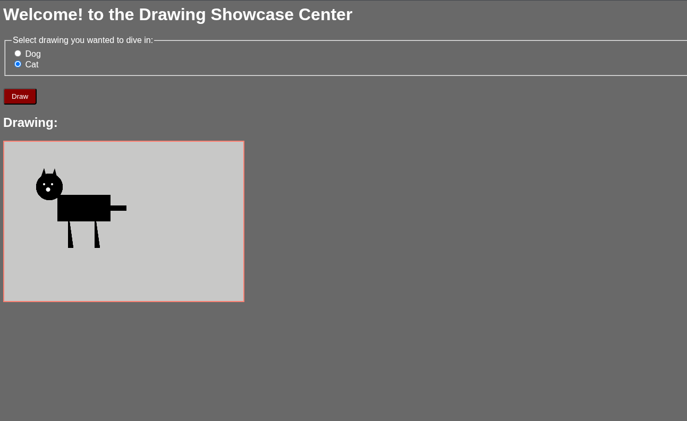

# Drawing Showcase

This project let's you see differnet drawings in canvas. Currently I've only two drawings "Dog" and "Cat" which you can select either of these  and draw it.



## how to use it
GO to **dist/uri.txt**
### Select All
```bash
# windows
ctrl + a
# mac
cmd + a
```
### Copy it
```bash
# windows
ctrl + c
# mac
cmd + c
```

Now paste it in your browser search tab and hit **Enter**.

and then you will be able to see the webpage and you can explore further.

## how it works
Just go on to the page (if you don't know how to see page read **how to use it** section) and select one of those option and hit enter your drawing will be generated.

## building
```
npm install
node build.mjs
```